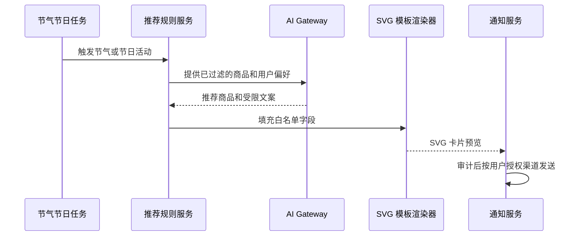

# AI 导购与节日卡片

## 首期功能

AI 导购接收用户的预算、人数、菜品偏好、过敏或忌口条件、节气/节日和收货区域，返回可解释的商品组合。推荐优先过滤营业商家、配送范围、上架商品、可用库存和用户限制；DeepSeek 只负责生成推荐理由与查询文案，价格、库存、订单权限和优惠计算由后端业务服务提供。

## DeepSeek 配置与边界

后端通过 DeepSeek OpenAI 兼容接口调用 `https://api.deepseek.com/chat/completions`。本地密钥从 `backend/config/application-local.yml` 的 `ai.deepseek.api-key` 读取；主配置通过可选导入加载该文件，因此未创建该文件时服务仍可启动，但 AI 接口会返回“服务不可用”。仓库提供 `backend/config/application-local.example.yml` 作为模板。实际本地配置文件已被 Git 忽略，禁止把密钥写入代码、示例文件、数据库和日志。

首次配置时，在 `backend` 目录执行以下命令后编辑生成的文件：

```powershell
Copy-Item .\config\application-local.example.yml .\config\application-local.yml
notepad .\config\application-local.yml
```

可按需在该文件设置 `base-url`、`model`（默认 `deepseek-chat`）和 `timeout-seconds`（默认 `15`）。

启动时请从 `backend` 目录执行 Maven 命令，使 `./config/application-local.yml` 能被加载。数据库账号可在同一文件的 `db.username`、`db.password` 中配置，环境变量 `DB_USERNAME`、`DB_PASSWORD` 及各业务库变量优先级更高。若日志出现 `Access denied for user 'freshmart'@'localhost' (using password: NO)`，说明 DeepSeek 配置已加载但数据库密码未配置；这是 MySQL 账号认证问题，不是模型接口问题。请先用数据库管理员确认应用账号密码，再补齐本地配置凭据。

调用模型前，后端只传递当前可售商品的受控摘要，或当前登录用户本人的最近订单摘要。模型无数据库连接、无下单能力、无支付退款权限，也不能访问其他用户、商家或配送数据。未配置密钥、超时或供应商请求失败时，接口返回服务不可用，不以规则文案伪造模型结果。

首期商家端提供经营数据看板，按统计周期展示销售额、订单量、客单价、销量排名、库存预警和履约指标，并附带统计口径与时间范围。首期不调用 AI 生成经营结论或运营动作；待数据质量、授权边界和指标口径稳定后，再接入 AI 经营分析能力。

## 节日推送卡片



卡片基于 `backend/src/main/resources/ai/card-templates/seasonal-recommendation.svg`，仅允许替换标题、描述和节气标签等文本占位符。渲染器必须对文本做 XML 转义并限制长度，不允许模型返回 SVG 标签、脚本、外部链接或任意样式。首期输出为站内消息卡片；其他发送渠道待确认。

## 导购接口草案

| 方法 | 路径 | 权限 | 说明 |
| --- | --- | --- | --- |
| POST | `/api/ai/assistant/messages` | 登录用户 | 基于需求推荐商品或查询本人订单 |
| POST | `/api/admin/ai/holiday-cards` | 管理员 | 创建并向指定用户发送 SVG 节日卡片 |
| GET | `/api/merchant/dashboard` | 商家 | 获取按统计周期聚合的经营数据看板 |
