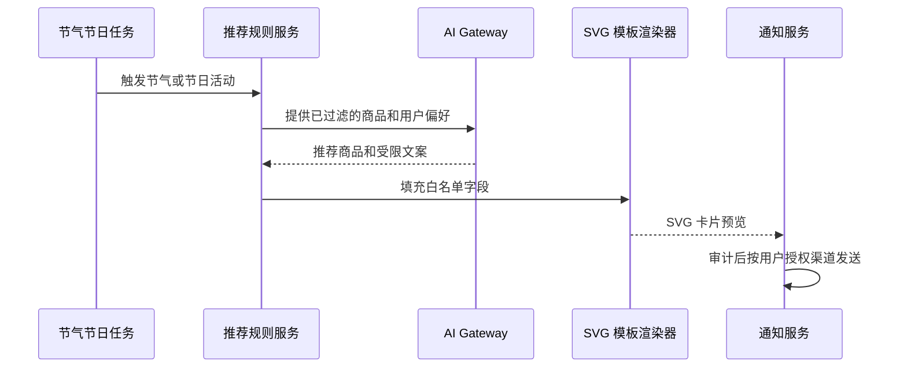

# AI 导购与节日卡片

## 首期功能

AI 导购接收用户的预算、人数、菜品偏好、过敏或忌口条件、节气/节日和收货区域，返回可解释的商品组合。推荐优先过滤营业商家、配送范围、上架商品、可用库存和用户限制；模型只负责排序、理由与文案，价格、库存和优惠计算由后端业务服务提供。

首期商家端提供经营数据看板，按统计周期展示销售额、订单量、客单价、销量排名、库存预警和履约指标，并附带统计口径与时间范围。首期不调用 AI 生成经营结论或运营动作；待数据质量、授权边界和指标口径稳定后，再接入 AI 分析能力。

## 节日推送卡片

卡片基于 `backend/src/main/resources/ai/card-templates/seasonal-recommendation.svg`，仅允许替换标题、描述和节气标签等文本占位符。渲染器必须对文本做 XML 转义并限制长度，不允许模型返回 SVG 标签、脚本、外部链接或任意样式。首期输出为站内消息卡片；其他发送渠道待确认。

## 导购接口草案

| 方法 | 路径 | 权限 | 说明 |
| --- | --- | --- | --- |
| POST | `/api/ai/recommendations` | 登录用户 | 基于需求返回商品组合和推荐理由 |
| GET | `/api/ai/seasonal-card` | 登录用户 | 获取当前节气/节日推荐 SVG 卡片预览 |
| GET | `/api/merchant/dashboard` | 商家 | 获取按统计周期聚合的经营数据看板 |
