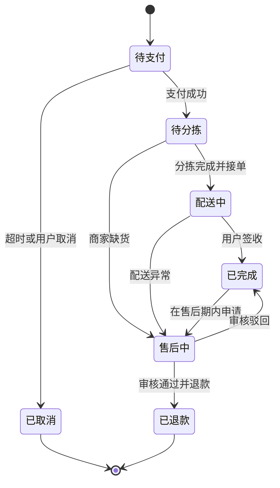

# 业务规则与状态机

## 订单主状态

## 必须保持的规则

- 金额由后端计算，前端提交的价格只作为展示；订单保存商品单价、优惠、运费和应付金额快照。
- 创建订单、支付回调、取消订单、退款回调均要求幂等键；重复请求不得重复扣库存或退款。
- 支付成功后才进入待分拣；未支付订单释放库存预占。退款能否回补库存由分拣和配送节点决定。
- 生鲜称重商品需要明确按件、按重量或称重后补差三种计价模式，不在前端自行推导。
- 商家只能读写自己店铺的数据；配送员只能访问被指派任务及完成配送所需的最小用户信息。
- AI 输出为建议或查询结果，不替代订单、支付、退款、权限等确定性决策。
- 一笔交易单按商家拆分履约子订单；每个商家只生成一个配送任务，配送员任务数据不得跨商家合并。
- 售后问题类型限定为 `缺货`、`品质问题`；申请必须同时提供图片和文字描述。运输途中损坏只能作为品质问题的证据类型，其他问题不开放。

## 资金状态约束

| 单据 | 允许流转 | 触发方 |
| --- | --- | --- |
| 支付单 | `PENDING` / `PROOF_SUBMITTED` -> `PAID` | 运营或财务审核截图、匹配账单或处理对账异常 |
| 支付单 | `PENDING` / `PROOF_SUBMITTED` -> `CANCELLED` | 用户取消或库存预占超时任务 |
| 支付单 | `PENDING` / `PROOF_SUBMITTED` -> `ABNORMAL` | 账单金额、方向、备注或流水异常 |
| 支付单 | `ABNORMAL` -> `PAID` / `PENDING` | 已认领的对账差异由运营或财务处理完成 |
| 支付单 | `PAID` -> `REFUNDED` | 同一交易全部子订单退款成功 |
| 退款单 | `PENDING` -> `MANUAL_PROCESS` | 售后审核通过，等待人工转账 |
| 退款单 | `MANUAL_PROCESS` -> `REFUND_SUCCESS` / `REFUND_FAIL` | 运营或财务确认转账成功或失败 |
| 退款单 | `REFUND_FAIL` -> `MANUAL_PROCESS` | 运营或财务填写原因后重新发起人工退款 |
| 对账差异 | `UNHANDLED` -> `HANDLING` -> `HANDLED` | 运营或财务认领并填写处理结论 |
| 对账差异 | `HANDLING` -> `PENDING_SHELVE` | 暂时无法核实，保留认领和说明 |

`REFUNDED`、`REFUND_SUCCESS` 和 `HANDLED` 是闭环状态，不允许回退。技术角色不拥有资金接口权限，禁止通过业务接口或裸改数据库修改资金状态。每次状态变化必须写入 `financial_status_logs`，保留操作人、时间、前后状态、动作编码、备注和来源。
