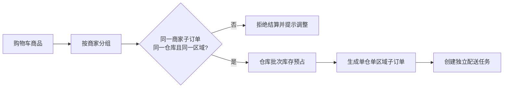

# 仓储追溯与开放 API

## 多仓边界

一个商家可在固定配送区域内配置多个仓库，仓库属于唯一商家且绑定唯一配送区域。用户可以创建多商家交易单，但每个商家子订单必须只关联一个仓库和一个配送区域。系统不自动做跨仓或跨区域拆单；结算时发现购物车中同一商家的商品跨仓或跨区时，必须提示用户调整商品，不得拆分生成多个子订单。

不同商家分别拥有仓库、库存批次和配送任务的访问边界。仓库管理人员、商家账号和开放 API 客户端都只能读取被授权商家的数据。

## 批次追溯与临期促销

库存以 `仓库 + 商品 + 批次` 管理。创建交易时，库存预占记录关联到明确的订单项；支付确认扣减批次库存后，系统将实际出库批次、仓库和克数写入 `order_item_batch_allocations`。这避免同一订单重复购买同一商品时发生批次错配。出现质量问题时，可从订单项追溯至具体批次和仓库。

后台以平台规则 `batch.near.expiry.days`（默认 3 天）筛选仍有可售库存、未过期批次进入低价促销候选清单。管理员确认后创建批次促销，促销必须在批次过期日前结束且同一批次排期不得重叠；促销仅作用于指定批次，不修改同商品其他仓库或其他批次价格。用户下单时按实际预占批次的克数计算批次折扣，并在库存预占、订单项和出库分配中保存折扣快照。

## 电子小票

支付确认后的订单可通过 `GET /api/orders/{orderId}/receipt` 生成并读取不可变 JSON 快照，包含订单号、商家、仓库、配送区域、商品重量、批次分配、商品金额、优惠、配送费、支付金额与生成时间。`GET /api/orders/{orderId}/traceability` 返回订单项与实际出库批次。用户仅可查询自己的订单，商家仅可查询自己名下子订单，管理员可查询全部订单；待支付和已取消订单不可查询。小票不作为税务发票。

## 开放 API

开放 API 首期服务于已审核商家或平台合作方。管理员创建客户端时只展示一次明文密钥，数据库仅保存 `secret_hash`。请求必须携带 `X-Api-Key`、`X-Api-Secret`、`X-Api-Timestamp`、`X-Api-Nonce` 和 `X-Api-Signature`。签名原文为 `HTTP_METHOD + "\\n" + 请求路径及查询串 + "\\n" + 时间戳 + "\\n" + nonce`，使用明文密钥计算 HMAC-SHA256 后以 Base64URL 编码；服务端校验 BCrypt 密钥、5 分钟时间窗、nonce 唯一性、有效期、最小权限范围和商家边界，并写入访问日志。数据库不保存明文密钥。

首期计划开放：商品查询、库存查询、订单查询、电子小票查询和批次追溯查询。涉及订单创建、支付、退款、余额、平台规则和 AI 工具调用的写接口不对外开放。

## 容量与媒体约束

首期目标为日订单量 50 单、并发用户 20 人，只建设网页端。图片和视频上传单文件不得超过 30 MB，即 `31,457,280` 字节；服务端和数据库均校验文件大小。生产扩容时优先增加对象存储、Redis 缓存和数据库连接池，再按监控结果拆分订单、库存或 AI 网关服务。
