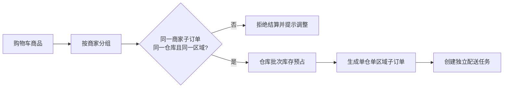

# 仓储追溯与开放 API

## 多仓边界

一个商家可在固定配送区域内配置多个仓库，仓库属于唯一商家且绑定唯一配送区域。用户可以创建多商家交易单，但每个商家子订单必须只关联一个仓库和一个配送区域。系统不自动做跨仓或跨区域拆单；结算时发现购物车中同一商家的商品跨仓或跨区时，必须提示用户调整商品，不得拆分生成多个子订单。

不同商家分别拥有仓库、库存批次和配送任务的访问边界。仓库管理人员、商家账号和开放 API 客户端都只能读取被授权商家的数据。

## 批次追溯与临期促销

库存以 `仓库 + 商品 + 批次` 管理。订单项通过 `order_item_batch_allocations` 记录实际出库批次、仓库和克数，电子小票显示商品、单价、重量、优惠、批次号和订单号。出现质量问题时，可从订单项追溯至具体批次和仓库。

后台以“距过期日 3 天”为默认临期阈值，筛选可用库存批次进入低价促销候选清单。管理员确认后创建批次促销，促销仅作用于指定批次，不修改同商品其他仓库或其他批次价格。

## 电子小票

订单完成后生成不可变的 JSON 快照小票，包含订单号、商家、仓库、配送区域、商品重量、批次分配、商品金额、优惠、配送费、支付金额与生成时间。小票在用户订单页和商家订单详情页可查询，不作为税务发票。

## 开放 API

开放 API 首期服务于已审核商家或平台合作方。管理员创建客户端时只展示一次明文密钥，数据库仅保存 `secret_hash`。客户端必须带有 API Key 和签名，服务端校验有效期、最小权限范围、商家边界和请求幂等键，并写入访问日志。

首期计划开放：商品查询、库存查询、订单查询、电子小票查询和批次追溯查询。涉及订单创建、支付、退款、余额、平台规则和 AI 工具调用的写接口不对外开放。

## 容量与媒体约束

首期目标为日订单量 50 单、并发用户 20 人，只建设网页端。图片和视频上传单文件不得超过 30 MB，即 `31,457,280` 字节；服务端和数据库均校验文件大小。生产扩容时优先增加对象存储、Redis 缓存和数据库连接池，再按监控结果拆分订单、库存或 AI 网关服务。
