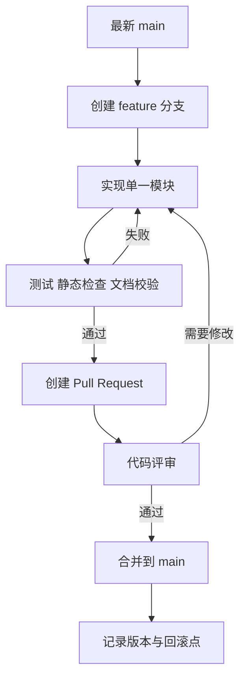

# 分支开发流程

## 约束

主分支 `main` 只保存可演示基线和已验证架构。开发各功能模块必须使用独立分支，不能直接修改 `main`。本规则适用于后端、前端、数据库迁移、AI 能力和运营功能。

## 标准流程

## 命名与提交

- 功能：`feature/<module>-<topic>`。
- 修复：`fix/<topic>`。
- 文档或治理：`docs/<topic>` 或 `chore/<topic>`。
- 一个提交只表达一个意图；数据库迁移、接口、测试和文档应在同一功能分支中保持一致。

## 合并门禁

合并前至少检查：Mermaid 严格校验、SVG/XML 或前端构建检查、Java 编译/单元测试、数据库迁移静态检查和 `git diff --check`。禁止用强制推送覆盖 `main`；需要回滚时优先执行反向提交或回滚到已标记提交。
