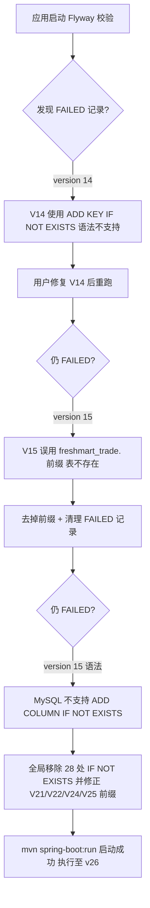

# 开发变更日志

本日志记录策略、业务规则、代码实现、优化和验证结果。每次提交必须追加一条记录；测试失败也必须保留，不得只记录成功结果。

## 2026-09-13

### LOG-20260913-036 个人微信收款码预支付数据库契约修复

- 类型：缺陷修复、支付适配器与多库 schema 一致性
- 策略/规则：个人收款码预支付单必须保存受控二维码 URL；既有开发库若在个人支付适配器前已执行初始支付迁移，后续迁移必须明确补齐该字段。启动自检应覆盖运行时查询的关键支付字段，避免接口调用后才出现 SQL 错误。
- 实现：新增 V29，以 `information_schema` 条件 DDL 为 `freshmart_trade.payment_orders` 补齐 `code_url VARCHAR(512)`；`DomainSchemaReadinessVerifier` 同步校验该列。
- 验证：实时 MySQL 检查确认 V24/V27/V28 已成功执行，`payment_orders` 缺少 `code_url`，与预支付接口的 `Unknown column 'code_url'` 错误一致。8082 临时实例启动时成功执行 V29，Flyway 到 v29；使用 `consumer-test-01` 创建的既有待支付订单完成预支付回归，返回 `PENDING`、金额 22 元、二维码地址 `/public/payment-qr` 和订单备注；二维码接口返回 HTTP 200、`image/jpeg`、127837 字节。主源码 `mvn -DskipTests compile` 通过。
- 提交：待提交

### LOG-20260913-037 本地媒体资产与支付售后凭证闭环

- 类型：功能开发、媒体安全与证据归属控制
- 策略/规则：图片或视频单文件不得超过 30 MB；付款凭证和售后证据只能引用当前用户上传的图片。运营、财务和管理员可读取凭证以审核，其他用户不得读取。媒体文件路径不直接对公网暴露，媒体元数据必须记录上传者、类型、大小和存储键以保留留痕。
- 实现：新增 V30 `freshmart_log.media_assets`；上传接口限制 JPEG、PNG、WebP、MP4、MOV 与 30 MB，文件保存为随机存储名，返回 `/api/media/{storageKey}`；新增受认证下载和上传者/资金审核角色授权；付款截图与售后证据提交前校验归属且仅接受图片。
- 验证：V30 已成功迁移并启动完成。首次 PowerShell 上传将 `.jpg` 标记为 `application/octet-stream`，被严格 MIME 校验拒绝，已记录并修正为仅对缺失或通用 MIME 按受限扩展名归一化；8084 联调上传收款码图片返回 `/api/media/868ffe862e1a44e4b0bf9ed676de17f8`，本人读取和管理员读取均 HTTP 200，其他用户读取 HTTP 403；该 URL 作为付款凭证提交成功，支付单进入 `PROOF_SUBMITTED`。主源码编译通过。
- 提交：待提交

### LOG-20260913-038 收款码与媒体配置文档同步

- 类型：文档与本地配置模板维护
- 策略/规则：个人收款码图片通过本地配置文件注入，仓库只保留可替换模板；媒体上传接口和付款/售后凭证接口使用同一受保护资产 URL，不能依赖直接暴露本地目录。
- 实现：在 `application-local.example.yml` 增加个人收款码 URL/文件路径模板，修正交易支付文档配置项说明，补充数据库初始化 V29/V30 说明。
- 验证：模板不包含数据库密码、DeepSeek 密钥或真实收款码路径；`git diff --check` 通过。
- 提交：待提交

### LOG-20260913-039 积分抵扣规则与订单冻结

- 类型：营销功能开发、积分台账与退款规则
- 策略/规则：1000 积分抵 1 元，仅抵扣商品金额、不抵配送费；单笔最高抵扣优惠后商品金额的 3%。下单时冻结所用积分，未支付超时释放；支付成功后积分视为消费，退款不返还已抵扣积分，但仍按原规则回退该订单已发放的消费积分。
- 实现：新增 V31 积分账户、订单抵扣快照和平台规则；交易请求支持 `pointsToRedeem`，按商家子订单比例写入抵扣金额，冻结/释放积分流水；媒体及支付改动保持不变。
- 验证：V31 已成功执行并完成下单抵扣验证：商品金额 16 元，3% 上限 0.48 元，冻结 480 积分，应付 21.52 元。超时释放在多实例测试中发现了竞态缺陷，已由 LOG-20260913-040 修复并待复测。
- 提交：待提交

### LOG-20260913-040 已取消订单积分释放幂等修复

- 类型：并发缺陷修复、积分台账一致性与测试补齐
- 策略/规则：积分抵扣仍执行 1000 积分抵 1 元、仅抵商品金额、单笔最高优惠后商品金额的 3%、退款不返还。未支付订单取消后必须归还冻结积分；返还不得依赖同一实例先释放库存，且同一交易只能生成一条 `REDEMPTION_RELEASED` 流水。
- 实现：库存预占超时任务新增独立的已取消交易扫描；在用户库事务内先以 `POINTS-RELEASE-{tradeId}` 写入唯一返还流水，再增加积分余额并回填余额快照。已存在流水时直接跳过，防止重复扫描和多实例竞争重复返还。
- 验证：`D:\\Apache Maven\\apache-maven-3.9.11\\bin\\mvn.cmd -f backend/pom.xml -DskipTests compile` 成功，编译 82 个主源码文件；`git diff --check` 通过。`mvn clean test` 在 Windows `testCompile` 阶段仍出现 50 个主源码类无法解析错误，未执行断言；需用户本机按既有成功方式复测超时释放和退款不返还抵扣积分。现有 8085 实例健康端点 HTTP 200，但该实例早于本次修复启动，不能作为本次任务回归证据。
- 提交：待提交

### LOG-20260913-041 Windows 测试环境协作约定

- 类型：测试策略与过程留痕
- 策略/规则：遇到 Windows Maven/Javac `testCompile` 类路径异常时，不在受限执行环境反复重试；由本机 PowerShell 环境执行完整回归并回传结果。主源码编译、静态检查与实际断言结果必须分别记录，不得互相替代。
- 实现：将后续完整测试的执行责任切换至本机 PowerShell 环境；本轮受限环境的失败已作为环境问题保留，不标记为业务功能失败。
- 验证：待用户执行完整 Maven 回归后补录测试数量和结果。
- 提交：待提交

### LOG-20260913-042 退款积分回退账实一致性修复

- 类型：缺陷修复、跨数据源事务与积分台账
- 策略/规则：退款不返还用户下单抵扣积分，但必须按退款金额比例回退该订单支付成功时发放的消费积分；账户余额、流水变更和余额快照必须在用户库同一事务内完成，并以退款单号保证幂等。
- 实现：退款积分回退改为用户库事务处理，锁定积分账户后检查 `POINTS-REFUND-{refundNo}` 幂等键，按可用余额计算实际回退值，同步更新 `user_point_accounts` 和 `points_transactions`。余额不足时不允许账户变为负数，已回退流水不会重复执行。
- 验证：`D:\\Apache Maven\\apache-maven-3.9.11\\bin\\mvn.cmd -f backend/pom.xml -DskipTests compile` 成功，编译 82 个主源码文件；`git diff --check` 通过。新增积分退款比例回退边界测试；完整回归按 LOG-20260913-041 交由用户本机 PowerShell 执行。
- 提交：待提交

### LOG-20260913-043 本机后端 30 项回归测试通过

- 类型：测试结果记录
- 策略/规则：完整回归必须在用户本机 PowerShell 环境执行；只有 `testCompile` 成功并进入 Surefire、且失败数和错误数均为 0，才记录为通过。
- 实现：无代码变更，记录用户回传的本机测试结果。
- 验证：用户在 `backend` 目录执行 `D:\\Apache Maven\\apache-maven-3.9.11\\bin\\mvn.cmd test`；Tests run: 30，Failures: 0，Errors: 0，Skipped: 0，BUILD SUCCESS，完成时间 `2026-09-13T17:18:07+08:00`。该结果覆盖 LOG-20260913-040 修复前后的现有测试集；LOG-20260913-042 新增测试待下一次回归。
- 提交：待提交

### LOG-20260913-044 本机后端 31 项回归测试通过

- 类型：测试结果记录
- 策略/规则：新增功能必须在用户本机 PowerShell 完整回归后，才能更新为已验证状态。
- 实现：无代码变更，记录退款积分回退修复后的完整测试结果。
- 验证：用户执行 `D:\\Apache Maven\\apache-maven-3.9.11\\bin\\mvn.cmd test`；Tests run: 31，Failures: 0，Errors: 0，Skipped: 0，BUILD SUCCESS，完成时间 `2026-09-13T17:32:48+08:00`。
- 提交：待提交

### LOG-20260913-045 售后库存检验处置闭环

- 类型：售后履约、库存一致性、权限与审计
- 策略/规则：缺货或品质退款完成后先进入 `PENDING_INSPECTION`；运营或管理员检验后只能单向标记为 `RESTOCKED` 或 `DISCARDED`。回收入库按订单实际批次分配克数恢复可用库存，报损不回补；同一退款单不得重复处理。
- 实现：新增 V32 处置处理人、处理时间和备注字段；新增 `PUT /api/admin/refunds/{refundNo}/inventory-disposition`，按批次分配更新商家库存并写入资金/履约状态日志；已处理处置记录受行锁与状态校验保护。
- 验证：`D:\\Apache Maven\\apache-maven-3.9.11\\bin\\mvn.cmd -f backend/pom.xml -DskipTests compile` 成功，编译 82 个主源码文件；`git diff --check` 通过。完整回归由用户本机 PowerShell 执行。
- 提交：待提交

### LOG-20260913-046 平台成本接口回归测试通过

- 类型：测试结果记录
- 策略/规则：平台成本只读汇总接口不得改变费用台账；后端改动须经本机完整回归后才能进入下一阶段。
- 实现：无代码变更，记录用户回传的本机测试结果，覆盖 V32 库存处置接口和平台成本汇总接口对应的编译产物。
- 验证：用户本机 PowerShell 执行 `D:\\Apache Maven\\apache-maven-3.9.11\\bin\\mvn.cmd test`；Tests run: 31，Failures: 0，Errors: 0，Skipped: 0，BUILD SUCCESS。测试完成后继续推进，无新增断言失败。
- 提交：待提交

### LOG-20260913-047 配送接单超时规则后台化

- 类型：规则后台化、配送履约与配置收敛
- 策略/规则：配送员接单超时由管理员后台规则控制；规则变更应对后续派单即时生效，配置文件只在规则数据缺失时兜底。超时时长必须为正整数。
- 实现：新增 V33 规则 `delivery.accept.timeout.minutes`，默认 5 分钟；派单服务改为直接读取平台规则，Controller 不再持有固定配置值。
- 验证：待主源码编译、Flyway V33 迁移和用户本机完整回归测试。
- 提交：待提交

### LOG-20260913-048 售后 AI 辅助审核建议

- 类型：AI 辅助、售后风控、权限与审计
- 策略/规则：AI 只读取退款类型、用户描述、证据图片数量和送达时间等事实，生成核查清单和风险提示；不得直接批准/拒绝退款，不得修改订单、资金或库存状态。运输损坏只能作为品质问题证据。最终状态仍由客服、运营或财务人工接口变更。
- 实现：新增 `POST /api/admin/refunds/{refundNo}/ai-review-suggestion`，限制管理员、运营和财务角色；新增 `RefundAiReviewService` 调用 DeepSeek 生成不超过 180 字的建议，响应包含强制人工审核免责声明，并写入 AI 审计日志。
- 验证：待主源码编译和用户本机完整回归测试；未调用真实模型，不记录或提交模型密钥。
- 提交：待提交

### LOG-20260913-049 本机后端 31 项回归测试通过

- 类型：测试结果记录
- 策略/规则：V33 配送接单超时规则和售后 AI 辅助审核建议纳入既有后端回归集；测试必须在用户本机 PowerShell 完成并进入 Surefire。
- 实现：无代码变更，记录用户确认的本机回归结果。
- 验证：用户反馈测试数仍为 31 项且一切正常，失败 0、错误 0、跳过 0；V33 规则和 AI 审核建议未引入回归。
- 提交：待提交

### LOG-20260913-050 AI 调用摘要审计

- 类型：AI 治理、审计留痕与数据最小化
- 策略/规则：模型调用仅记录操作人、场景、关联对象、模型名、请求和响应 SHA-256 摘要、执行状态与错误码；不得落库 API 密钥、完整提示词、用户敏感描述或模型全文。审计失败不改变 AI 的业务读写边界。
- 实现：新增 V34 `freshmart_log.ai_interaction_logs`；新增摘要审计服务，接入导购、本人订单查询和退款审核建议的成功/失败调用；启动结构自检同步校验该表。
- 验证：待主源码编译、Flyway V34 迁移与用户本机完整回归测试。
- 提交：待提交

### LOG-20260913-051 商家结算确认与反冲留痕

- 类型：佣金结算、资金状态机与审计
- 策略/规则：已送达订单生成待结算单；仅管理员或财务可将 `PENDING` 单据确认至 `SETTLED`，且必须填写备注。退款后已结算单仍按现有受控逻辑反冲为 `REVERSED` 并生成佣金反冲流水，禁止任意回改。
- 实现：新增 V35，结算单保存确认人和备注；新增 `PUT /api/admin/commissions/{settlementId}/confirm`，采用行锁和状态校验确认结算，写入通用审计日志。
- 验证：待主源码编译、Flyway V35 迁移与用户本机完整回归测试。
- 提交：待提交

### LOG-20260913-046 平台成本台账汇总接口

- 类型：运营财务能力、费用口径与只读接口
- 策略/规则：平台价格补贴、平台承担称重差额、退款损失、佣金及反冲统一以 `fee_ledgers` 为事实来源；汇总按费用类型和借贷方向统计，使用自然日左闭右开范围，不重复生成费用流水。
- 实现：新增 `GET /api/admin/platform-costs?from=YYYY-MM-DD&to=YYYY-MM-DD`，允许管理员、运营和财务查询费用类型、方向、金额和笔数；复用现有费用台账与幂等记账逻辑。
- 验证：待主源码编译与用户本机完整回归测试。
- 提交：待提交

### LOG-20260913-025 Flyway 迁移启动失败修复（V15–V25 语法与库名前缀）

- 类型：缺陷修复、数据库迁移与启动恢复
- 策略/规则：Flyway 在应用启动时校验 `flyway_schema_history`，一旦发现 `success=0` 的 FAILED 记录立即中止且不会重跑该迁移；迁移脚本必须适配 MySQL 8.0 语法（不支持 `ALTER TABLE ... ADD COLUMN/KEY/INDEX IF NOT EXISTS`，仅 `CREATE TABLE IF NOT EXISTS` 合法），跨库表名前缀必须与表实际所在 schema 一致。
- 实现：
  - 修正 V15：去掉误写的 `freshmart_trade.` 前缀（`order_items` / `inventory_reservations` / `order_item_batch_allocations` 实际位于 `freshmart`，与 V1–V14 写法一致）。
  - 全局移除 V15/V17/V19/V21/V22/V24/V25 共 **28 处** `ADD COLUMN/KEY/INDEX IF NOT EXISTS` 中的非法 `IF NOT EXISTS`（`CREATE TABLE IF NOT EXISTS` 合法，未改动）。
  - 修正 V21/V22/V24/V25 中被错写成 `freshmart_trade.` 的前缀：`order_items`、`weighing_adjustments`、`refund_orders` 实际位于 `freshmart`；`freshmart_trade.merchant_settlements`、`payment_orders` 等确在 trade 库，保持不动。
  - 清理 `flyway_schema_history` 中遗留的 FAILED 记录（version 15、21 等），使 Flyway 重新执行这些迁移。
- 验证：`mvn spring-boot:run` 由原本启动即失败，推进到 V14 修复→V15 修复→V26 全部通过；日志显示 `Successfully applied ... now at version v26`、`Tomcat started on port 8080`、`Started FreshMartApplication in 3.1 seconds`。修复链路（流程图）：



- 提交：待提交

### LOG-20260913-026 多库 schema 不一致导致的运行时定时任务报错

- 类型：缺陷修复、多数据源 schema 一致性与待办
- 策略/规则：应用使用多数据源（`freshmart` / `freshmart_trade` / `freshmart_delivery` / `freshmart_merchant` / `freshmart_user` / `freshmart_log`），同名表分布在多个库，但大量迁移只在 `freshmart` 副本上做 ALTER 变更；卫星库缺少应用代码期望的表/列时，应用虽能启动，但启动后后台 `@Scheduled` 任务会持续抛 SQL 错误。
- 实现：
  - 新增 **V26** 迁移：为 `freshmart_delivery.delivery_tasks` 补齐 `timeout_at` 列（V4 仅将该列加到 `freshmart` 副本），消除 `DeliveryService.releaseTimedOutAssignments` 的 `Unknown column 'timeout_at' in 'field list'`。
  - 发现 `InventoryReservationExpiryJob` 经 trade 数据源查询 `freshmart_trade.inventory_reservations`，但该表只存在于 `freshmart`（报 `Table 'freshmart_trade.inventory_reservations' doesn't exist`，Error 1146），**尚未修复**。
- 验证：V26 应用后 `timeout_at` 报错消除；`freshmart_trade.inventory_reservations` 缺失表问题在下一轮运行中复现，确认为**系统性多库 schema 不一致**——卫星库（trade/delivery 等）缺表/列，需架构级补齐策略而非逐个打补丁。后续三种方案待定：A 批量补齐卫星库表/列；B 调整数据源路由使相关代码统一走 `freshmart`；C 暂忽略后台任务，仅保启动。
- 提交：待提交

## 2026-09-11

### LOG-20260911-020 电子小票与订单批次追溯

- 类型：功能开发、数据一致性与接口边界
- 策略/规则：支付确认后才允许生成和读取电子小票、批次追溯；库存预占必须绑定订单项，扣减库存时写入实际批次分配，避免同一订单多商品或多批次错配。用户仅能查询自己的订单，商家仅能查询所属商家子订单，管理员可查询全部订单；待支付和已取消订单不提供小票。
- 实现：新增 V13 电子小票/批次分配表和 V14 库存预占订单项关联迁移；交易创建保存 `order_item_id`，支付确认写入 `order_item_batch_allocations`；新增 `GET /api/orders/{orderId}/receipt`、`GET /api/orders/{orderId}/traceability`；使用 JDBC `LocalDate`/`LocalDateTime` 映射并修正追溯查询批次字段。
- 验证：`mvn compile` 通过，43 个源文件编译成功；`git diff --check` 通过。本次 `mvn test` 在 `testCompile` 阶段失败，12 个测试源文件出现 41 个“找不到主类”错误，测试断言未执行；主类已在同一环境的 `compile` 阶段成功生成，故记录为既有 Windows Maven/Javac 测试类路径问题，待用户本机复核。
- 提交：待提交

### LOG-20260911-021 临期批次低价促销候选

- 类型：功能开发、规则落地与审计
- 策略/规则：按平台规则 `batch.near.expiry.days`（默认 3 天）筛选未过期且仍有可售库存的批次；管理员确认促销时，折扣率必须大于 0 且小于 100，结束时间不得晚于批次过期日，同一批次活动时间不得重叠。促销只绑定批次，不修改商品、其他仓库或其他批次价格。
- 实现：新增 `BatchPromotionService`、`BatchPromotionController`；提供 `GET /api/admin/marketing/batch-promotions/candidates` 和 `POST /api/admin/marketing/batch-promotions`，写入 `batch_promotions` 并记录审计日志。
- 验证：`mvn compile` 通过，45 个源文件编译成功；`git diff --check` 通过。交易结算应用批次折扣列入后续任务。
- 提交：待提交

### LOG-20260911-022 开放 API 客户端与商品只读接口

- 类型：功能开发、权限边界与访问审计
- 策略/规则：管理员创建开放 API 客户端时只返回一次明文密钥，数据库保存 BCrypt 哈希；客户端必须通过 Key/Secret、状态、有效期和 scope 校验。绑定商家的客户端只能看到该商家商品，平台客户端可看到全部已上架商品；每次请求写入访问日志。
- 实现：新增 `OpenApiClientService`、`OpenApiClientController` 和 `OpenApiCatalogController`；提供 `POST /api/admin/open-api/clients` 与 `GET /open-api/v1/products`，支持 `products:read` scope 和 `X-Request-Id` 访问追踪。
- 验证：`mvn compile` 通过，48 个源文件编译成功；`git diff --check` 通过。HMAC 签名头、库存/订单/小票/追溯只读接口列入下一步，当前 Secret 校验为本地首期适配。
- 提交：待提交

### LOG-20260913-023 临期批次折扣接入交易结算

- 类型：功能开发、价格规则与数据一致性
- 策略/规则：批次促销按实际预占克数计算额外用户优惠；商家毛收入、市场价补贴和基础商品单价不变。计算顺序固定为批次折扣后再计算会员和优惠券折扣；促销 ID、折扣率、克数和金额写入预占、订单项和出库批次分配快照，活动变化不影响已创建订单。
- 实现：新增 `BatchPromotionPolicy`、V15 批次促销结算快照字段；交易下单按当前有效批次活动锁定快照并更新子订单、交易单运费/优惠/应付金额；电子小票和追溯返回批次促销信息；新增 V16 商家库批次促销与开放 API 表，修正五库初始化脚本。
- 验证：`mvn compile` 通过，49 个源文件编译成功；`git diff --check` 通过。本次 `mvn test` 在 `testCompile` 阶段失败，13 个测试源文件出现 43 个“找不到主类”错误（包括新增 `BatchPromotionPolicyTest`），测试断言未执行；记录为既有 Windows Maven/Javac 类路径问题，待用户本机复核。
- 提交：待提交

### LOG-20260913-024 开放 API HMAC 与只读查询闭环

- 类型：功能开发、接口安全与跨库查询
- 策略/规则：开放 API 请求必须提供 Key、Secret、时间戳、nonce 和 HMAC-SHA256 签名；时间戳默认允许偏差 5 分钟，nonce 按客户端唯一，防止重放。客户端 scope 限定商品、库存、订单、小票和追溯读取；绑定商家的客户端只能访问该商家数据，平台客户端可访问全部授权数据。所有请求写入访问日志并记录响应状态。
- 实现：新增 V17 nonce 唯一约束和签名配置；增强 `OpenApiClientService` 的 BCrypt、HMAC、时间窗、nonce 与 scope 校验；新增 `OpenApiReadService`、`OpenApiReadController`，实现库存、订单、电子小票和批次追溯只读接口。
- 验证：`mvn compile` 通过，51 个源文件编译成功；`git diff --check` 通过。完整 `mvn test` 受既有 Windows Maven/Javac 测试类路径问题阻塞，断言未执行。
- 提交：待提交

### LOG-20260911-019 实际称重补差记录

- 类型：功能开发、规则落地与测试
- 策略/规则：商家或管理员提交实际商品金额后，按预付金额与实际金额差值计算；差额不超过平台规则 `weighing.platform.absorb.limit`（默认 1.50 元）时平台承担，低于预付金额生成待退款金额，超过上限进入人工复核；每个订单只允许一条称重调整且使用 `Idempotency-Key` 幂等。
- 实现：新增 `POST /api/weighing-adjustments`、`WeighingAdjustmentService`、V12 `weighing_adjustments` 表和多库初始化表；校验商家归属、金额非负、规则动态读取并保存调整动作。
- 验证：`mvn compile` 通过，41 个源文件编译成功；`mvn test` 需在用户本机复核，当前沙箱仍有测试类路径阻塞。
- 提交：待提交

### LOG-20260911-018 平台规则后台配置接口

- 类型：功能开发、规则落地与测试
- 策略/规则：配送费门槛/金额、库存预占时长、市场价上浮比例和积分倍率由 `platform_rules` 数据库记录作为运行时优先值；环境变量只在规则缺失或格式错误时兜底。规则值必须匹配声明类型，管理员修改必须记录操作审计。
- 实现：新增 `PlatformRuleService` 和管理员接口 `GET /api/admin/platform-rules`、`PUT /api/admin/platform-rules/{ruleKey}`；增加核心库 `coreJdbcTemplate`；交易下单动态读取配送费、预占时长和市场价上浮规则，支付积分动态读取积分倍率；新增 V11 默认规则迁移。
- 验证：`mvn compile` 通过，39 个源文件编译成功；`git diff --check` 通过。当前沙箱执行 `mvn test` 在测试编译阶段无法解析 `target/classes` 中的既有主类（41 个符号错误，测试用例未执行），与此前 Windows Maven/Javac 类路径问题一致；需在用户本机复核完整回归。
- 提交：待提交

### LOG-20260911-017 退款提交推送凭据失败

- 类型：版本控制与问题记录
- 策略/规则：推送失败时保留已提交代码，不关闭 SSL 校验或覆盖用户凭据；必须记录失败原因并在已授权终端重试。
- 实现：尝试推送退款审核提交 `32d3237` 至 `origin/feature/auth-rbac-merchant-onboarding`。
- 验证：当前沙箱三次执行 Git push 均返回 `schannel: AcquireCredentialsHandle failed: SEC_E_NO_CREDENTIALS (0x8009030e)`；本地提交保持完整，待用户已授权终端执行 `git push`，本条也涵盖后续提交 `94a3384`、`fa5ad85`。
- 提交：`32d3237`、`94a3384`、`fa5ad85`

### LOG-20260911-016 售后审核与余额退款闭环

- 类型：功能开发、规则落地与文档同步
- 策略/规则：客服审核是退款最终决策；拒绝申请保留审核备注。审核通过后按支付渠道退款，余额支付退回用户钱包并写入幂等流水；退款单、子订单、费用台账和积分均产生反向记录，重复审核不得重复退款。
- 实现：新增 `PUT /api/admin/refunds/{refundId}/review`；实现客服批准/拒绝、余额退款、`REFUND` 费用台账、子订单 `REFUNDED` 状态和按实付金额比例回退积分；补充 `refund_orders` 表结构。
- 验证：`mvn compile` 通过，37 个源文件编译成功；`git diff --check` 通过。完整 `mvn test` 仍需在用户本机授权终端复核，当前沙箱存在 Maven/Javac 测试类路径限制。
- 提交：待提交

### LOG-20260911-013 GitHub 分支首次推送成功

- 类型：版本控制与验证
- 策略/规则：本地提交完成后推送当前功能分支，远程分支必须设置上游跟踪；推送结果和 PR 入口留痕。
- 实现：用户完成 GitHub CLI 设备授权，将 `feature/auth-rbac-merchant-onboarding` 推送至 `origin`，远程创建同名分支并返回 PR 地址。
- 验证：远程返回 `new branch`，并确认 `branch ... set up to track origin/...`；PR 地址为 `https://github.com/MIutopia/freshmart/pull/new/feature/auth-rbac-merchant-onboarding`。
- 提交：远程已包含本地提交 `79a2ad1`

### LOG-20260911-014 售后申请基础链路

- 类型：功能开发与规则落地
- 策略/规则：售后仅允许 `OUT_OF_STOCK` 和 `QUALITY`；运输损坏只能在品质问题描述/证据中说明；申请人必须是订单用户，订单必须已支付并送达，默认送达后 1 天内申请，必须提供图片和描述；申请使用 `Idempotency-Key` 幂等，首期只创建待审核退款单，不自动退款。
- 实现：新增 `POST /api/refunds`、退款单表初始化和 `RefundService`，校验订单归属、支付状态、配送送达时间、时限、问题类型和证据完整性。
- 验证：`mvn compile`，37 个源文件编译成功；`git diff --check` 待提交前执行；客服审核、原路退款、库存/积分/佣金反向流水仍未接入。
- 提交：`94ddc51`

### LOG-20260911-015 远程推送凭据阻塞

- 类型：版本控制与问题记录
- 策略/规则：远程推送失败时保留本地提交，不关闭 SSL 校验，不覆盖用户凭据配置。
- 实现：在当前沙箱重试推送 `94ddc51` 及后续日志提交；Git Credential Manager/`gh` 凭据不可用，Git 返回 `SEC_E_NO_CREDENTIALS`。
- 验证：此前用户终端已成功推送至 `origin/feature/auth-rbac-merchant-onboarding`；本轮新增提交需在已授权终端补执行 `git push`。
- 提交：待提交

### LOG-20260911-012 余额支付基础链路与远程推送

- 类型：功能开发、版本控制与验证
- 策略/规则：余额支付只能由后端按交易应付金额扣款；余额不足拒绝支付；钱包扣款必须写入幂等流水，交易结算异常时补偿余额。当前分支最新提交先推送远程，推送失败原因必须留痕。
- 实现：新增 `POST /api/payments/{tradeNo}/confirm-balance`；增加钱包余额校验、扣款、支付流水和失败补偿，并复用库存扣减、配送任务、优惠券核销和积分发放流程。
- 验证：`mvn compile` 通过，35 个源文件编译成功；`git diff --check` 通过。首次推送 `f2a1056` 因 OpenSSL 证书链失败，切换 Windows `schannel` 后因当前 GitHub CLI 未登录（`SEC_E_NO_CREDENTIALS`）仍未完成；设备授权码 `5463-0344` 已生成，等待浏览器确认。
- 提交：`2600e20`

### LOG-20260911-008 会员权益与支付积分

- 类型：功能开发与规则落地
- 策略/规则：商家优惠券必须校验类型、门槛、优惠金额、总量和有效期；管理员可配置会员等级及折扣率；支付成功后按实付金额乘积分倍率向下取整发放积分，使用 `POINTS-交易号` 幂等键，积分不得在未支付订单产生。
- 实现：新增商家优惠券创建接口 `POST /api/merchant/marketing/coupons`；新增管理员会员等级接口 `POST /api/admin/marketing/membership-levels`；新增积分计算器与用户会员/优惠券查询领取接口；模拟支付确认写入用户积分流水。
- 验证：`mvn compile`，35 个源文件编译成功；`git diff --check` 无空白错误。随后执行 `mvn test` 和 `mvn clean test` 均在测试编译阶段失败：Javac 无法解析已生成的 `target/classes` 中既有主类（认证、订单、仓储及本次积分类），共 12 个测试源文件未进入执行阶段；属于当前 Windows/Maven 类路径环境问题，未修改测试规避。
- 提交：`36c99d5`

### LOG-20260911-009 下单营销结算与优惠券核销

- 类型：功能开发与规则落地
- 策略/规则：结算金额只能由后端计算；优惠券必须属于当前用户、处于有效期且匹配对应商家子订单；每张券的消费门槛按其商家子订单商品金额判断；多张券可叠加但总优惠不超过商品金额；会员折扣与优惠券结果写入订单价格快照；未支付订单超过 15 分钟时解除优惠券预占，支付成功后才标记为已使用。
- 实现：下单请求新增可选 `couponIds`；`TradeService` 按商家加载用户积分对应会员折扣与已领取优惠券，生成子订单和交易总额的优惠计算结果；新增优惠券预占、支付核销和到期释放。
- 验证：`mvn compile`，35 个源文件编译成功；完整 `mvn test` 沿用 LOG-20260911-008 已记录的 Windows Maven/Javac 测试编译类路径阻塞，待环境恢复后执行。
- 提交：`497a2e9`

### LOG-20260911-010 变更日志提交号校正

- 类型：文档维护
- 策略/规则：日志条目必须回填对应的实际提交号，不保留“待提交”占位。
- 实现：回填 LOG-20260911-008 和 LOG-20260911-009 的提交号。
- 验证：`git diff --check` 无空白错误。
- 提交：`32e0272`

### LOG-20260911-011 项目全过程与待办总览

- 类型：文档维护与项目梳理
- 策略/规则：项目进度回顾必须区分已确认规则、已实现代码、验证事实与后续待办；技术文档不得继续保留与当前代码冲突的“未实现”描述。
- 实现：新增 `项目过程总览.md`；同步交易与营销专题文档，反映优惠券核销、会员折扣、支付积分和超时释放已经接入。
- 验证：核对提交历史、开发日志、当前后端包和前端目录；`git diff --check` 无空白错误。
- 提交：本次提交（本条随提交创建）

### LOG-20260911-006 全过程留痕约束

- 类型：流程策略
- 策略/规则：从本条开始，所有策略、规则、开发、优化和测试必须在本文件记录，提交信息与日志编号对应；失败结果同样保留。
- 实现：新增本日志文件、模板，并在决策日志中建立入口。
- 验证：已在后续每次提交中追加变更条目。
- 提交：`41d2ba3`。

### LOG-20260911-007 营销规则与优惠计算器

- 类型：功能开发与规则落地
- 策略/规则：支持优惠券、满减、会员等级、积分和秒杀规则；优惠可叠加；会员折扣和促销优惠由后端统一计算，总优惠不超过商品金额。
- 实现：新增营销规则表、商家创建规则接口、`PromotionCalculator` 和单元测试。
- 验证：`mvn compile`，32 个源文件编译成功；`git diff --check` 无问题；2026-09-11 用户本机执行 `mvn test`，20 项测试通过，失败 0、错误 0、跳过 0。
- 提交：`5d248ed`。

### LOG-20260911-001 商品与仓储库存

- 类型：功能开发与规则落地
- 策略/规则：商品按重量计价；商家价不得高于市场价 5%；仓库必须绑定固定配送区域；仓库可经营分类和商家分类仓配规则同时启用后才能入库和上架；商品、仓库、批次严格限制在同一商家。
- 实现：新增 `CatalogService`、商品与仓库接口、多库字段和初始化脚本。
- 验证：`mvn compile`，23 个源文件编译成功；`git diff --check` 无问题。
- 提交：`7699988`。

### LOG-20260911-002 配送区域与骑手工作台

- 类型：功能开发
- 策略/规则：平台统一配送；配送区域由后台配置；骑手只能查看自己的任务与绩效。
- 实现：新增区域管理、骑手任务和绩效查询接口。
- 验证：`mvn compile`，25 个源文件编译成功；`git diff --check` 无问题。
- 提交：`842c2ab`。

### LOG-20260911-003 交易、支付与库存预占

- 类型：功能开发与规则落地
- 策略/规则：多商家按商家拆分子订单；单商家单仓；库存预占 15 分钟；首期模拟扫码支付；支付成功后扣减库存并生成待派配送任务。
- 实现：新增交易创建、模拟预支付、模拟支付确认、费用台账和跨 Schema 事务；新增每 60 秒释放到期预占任务。
- 验证：`mvn compile`，28 个源文件编译成功；`git diff --check` 无问题。
- 提交：`090b049`、`d299b61`。

### LOG-20260911-004 测试账号凭据修正

- 类型：缺陷修复与测试
- 问题：本地测试账号原 BCrypt 哈希与文档密码 `password` 不匹配，认证测试失败。
- 实现：使用 Spring Security `BCryptPasswordEncoder` 重新生成哈希，增加 V9 修正迁移和 V10 管理员账号迁移。
- 验证：哈希匹配测试返回 `true`；用户本机完整测试通过 18 项。
- 提交：`f33243a`。

### LOG-20260911-005 配送履约状态机

- 类型：功能开发与规则落地
- 策略/规则：管理员按区域派单；骑手默认 5 分钟内接单；超时任务回派单池；取货和送达必须按状态顺序执行；每日记录派单、接单、送达、超时和准时率。
- 实现：补齐派单、接单、取货、送达接口和超时调度任务。
- 验证：`mvn compile`，29 个源文件编译成功；`git diff --check` 无问题；2026-09-11 用户本机执行 `mvn test`，18 项测试通过，失败 0、错误 0、跳过 0。
- 提交：`41d2ba3`。

## 后续记录模板

### LOG-20260913-001 佣金结算、经营看板与售后反冲

- 类型：功能开发、规则统一与验证
- 策略/规则：已送达子订单以商家毛收入扣除平台市场价补贴后的金额为佣金基数，默认佣金率由后台规则 `commission.default.rate` 配置；商家毛收入仍保留平台补贴。整张子订单退款时，已生成佣金结算单必须反冲。已送达售后商品不可在缺少实物验收前自动增加可售库存，因此建立待检验库存处置记录。
- 实现：新增商家佣金结算、管理员生成/查询和商家查询接口；新增商家经营看板，覆盖支付订单、销售额、退款、客单价、低库存、销量排行和配送履约指标。新增 `MerchantSettlementPolicy` 及测试，退款批准时反冲结算单和佣金费用台账，并写入 `refund_inventory_dispositions`。新增 V18、V19 和初始化脚本对应表结构。
- 验证：`mvn compile` 成功，分别编译 54、59、61、63 个主源码文件；`git diff --check` 通过。`mvn test` 在 `testCompile` 失败，14 个测试源文件、45 个错误，错误均为测试编译器无法解析既有和新增的 `target/classes` 主类，未执行任何断言；该 Windows Maven/Javac 类路径问题已保留，未以跳过测试规避。
- 提交：`f88c052`，仅本地提交，未推送远程。

### LOG-20260913-002 站内消息、节日 SVG 卡片、AI 导购与订单边界

- 类型：功能开发、权限收敛与验证
- 策略/规则：站内消息可查询、标记已读，并由管理员发送；节日卡片仅接受受限文本，生成内嵌 SVG 后保存到消息记录并留审计。首期 AI 只允许消费者调用，工具范围仅为公开在售库存商品推荐和当前用户自己的最近订单，不执行任意 SQL、不访问跨用户或跨商家数据。售后申请窗口优先读取后台规则 `refund.default.window.minutes`，环境变量仅作兜底。订单查询按消费者本人、商家所属订单和管理员全量三种边界控制。
- 实现：新增消息读取、已读和后台发送接口；新增节日 SVG 卡片发送接口、V20 消息表迁移；新增 AI 导购/订单查询接口；新增受权限约束的订单列表与详情接口。退款服务改为读取平台规则。
- 验证：`mvn compile` 成功，63 个主源码文件；`git diff --check` 通过。完整测试仍受 LOG-20260913-001 所述测试编译环境阻塞。
- 提交：`f88c052`，仅本地提交，未推送远程。

### LOG-20260913-003 秒杀库存预占与结算快照

- 类型：功能开发、并发规则与验证
- 策略/规则：秒杀按商品和重量计量，商家设置秒杀价、活动总克数和单用户限购克数。创建交易时原子预占秒杀克数，支付后转已售，15 分钟未支付则释放；秒杀优惠写入订单项价格快照，作为商家让利从佣金结算的商家毛收入中扣除。
- 实现：新增 `flash_sale_items`、`flash_sale_reservations`、订单项秒杀快照字段和 V21 迁移；新增商家创建秒杀接口与 `FlashSalePolicy` 测试；交易创建、支付确认、预占过期任务和佣金结算均接入秒杀状态与金额。
- 验证：`mvn compile` 成功，64 个主源码文件；`git diff --check` 通过。完整测试仍受 LOG-20260913-001 所述 `testCompile` 类路径问题阻塞。
- 提交：`f88c052`，仅本地提交，未推送远程。

### LOG-20260913-004 称重补差自动结算

- 类型：功能开发、资金规则与验证
- 策略/规则：实际商品金额低于预付商品金额时，差额退回首期测试余额；实际金额提高但未超过后台规则 `weighing.platform.absorb.limit` 时由平台承担并计入费用台账；超过上限维持人工复核，不生成自动扣款。所有自动动作使用固定幂等键并保存结算引用。
- 实现：新增 V22 称重结算状态字段；称重调整服务支持测试余额退款、平台承担费用台账和结算时间/引用记录。
- 验证：`mvn compile` 成功，64 个主源码文件。完整测试仍受 LOG-20260913-001 所述测试编译环境阻塞。
- 提交：`f88c052`，仅本地提交，未推送远程。

### LOG-20260913-005 提交号留痕校正

- 类型：文档维护
- 策略/规则：开发日志必须记录可解析的实际本地提交号；修正文档本身使用独立提交，避免修改历史提交造成原提交号变化。
- 实现：将 LOG-20260913-001 至 LOG-20260913-004 的提交号修正为承载功能实现的 `f88c052`。
- 验证：核对 `git log`、提交统计和工作区差异。
- 提交：本次文档校正提交。

### LOG-20260913-006 个人微信收款码支付

- 类型：支付方案调整、权限收敛与验证
- 策略/规则：首期取消微信商户号回调，固定采用个人微信收款码。收款码只从本地环境变量 `PERSONAL_WECHAT_QR_URL` 读取，绝不写入源码或版本库；由于个人收款码不存在可验证回调，只有管理员人工核验到账后才可确认支付，消费者无支付确认权限。
- 实现：预支付单改为 `PERSONAL_WECHAT_QR` / `MANUAL_CONFIRMATION`；新增收款码读取接口和管理员确认接口，移除消费者模拟确认接口；同步环境样例和支付技术文档。
- 验证：`mvn compile` 成功，64 个主源码文件；`git diff --check` 通过；扫描确认不存在 `confirm-simulated`、`SIMULATED://` 或微信商户号环境变量。
- 提交：`9bed73f`，仅本地提交，未推送远程。

### LOG-20260913-007 个人收款码默认值与迁移兼容

- 类型：规则调整、数据库迁移与验证
- 策略/规则：个人微信收款码是首期唯一扫码支付方式，商户号回调不在范围；历史 Flyway 迁移保持不可变，新增迁移覆盖新环境和已有环境的支付默认值。
- 实现：新增 V23，将支付单默认 `provider` 设为 `PERSONAL_WECHAT_QR`、`payment_mode` 设为 `MANUAL_CONFIRMATION`；初始化脚本同步默认值；更新价格结算、接口、规则和数据库文档。
- 验证：`mvn compile` 成功，64 个主源码文件；`git diff --check` 通过；旧商户号环境变量和消费者模拟确认接口扫描无结果。恢复 V2 原始内容以避免 Flyway 校验和冲突。
- 提交：`bb9043d`，仅本地提交，未推送远程。

### LOG-20260913-008 个人收款码支付退款适配器数据结构

- 类型：架构调整、数据库迁移、规则记录
- 策略/规则：个人收款码不提供官方回调，支付必须经过截图人工审核或账单导入匹配；退款审核通过后生成待人工退款工单，管理员确认实际转账后才完成退款。金额不一致、备注缺失、无法匹配和账单无记录等情况必须保留对账差异。
- 实现：新增 V24 迁移，为支付单增加备注、凭证、核验人和失败信息字段；新增支付核验、微信账单导入、账单流水和对账差异表；退款单增加人工退款状态、操作人、完成时间和失败原因。初始化脚本同步上述结构；交易、价格和接口文档同步适配器调用约定。
- 验证：`git diff --check`；核对 V24 与 `bootstrap-domain-databases.sql` 字段和索引一致性。Java 适配器业务实现及完整测试由后续提交记录。
- 提交：待本地适配器实现合并后补录。

### LOG-20260913-009 个人收款码适配器业务链路

- 类型：功能开发、幂等校验、对账与验证
- 策略/规则：个人收款码支付仅允许付款凭证人工审核或账单导入匹配；账单流水按交易号、金额和收入方向校验，重复流水、无法匹配和金额不一致均进入差异表；人工退款必须校验原支付单、订单、金额和幂等键，管理员确认转账后才完成原订单退款。
- 实现：新增统一账单导入模型与适配器接口；实现账单批量导入、原始流水留存、重复检测、差异记录和匹配成功后的交易结算；新增后台对账差异查询接口；加强截图提交、支付核验和人工退款的参数、状态及幂等校验；同步接口与交易文档路径。
- 验证：`mvn -DskipTests compile` 成功，76 个主源码文件；`git diff --check` 通过。完整 `mvn test` 仍在 `testCompile` 阶段受既有 Windows 测试类路径问题阻塞，未执行断言。
- 提交：待后端全部完成后统一提交并推送远程。

### LOG-20260913-028 文档状态清理与远程归档准备
- 类型：文档校正、版本归档与验证准备
- 策略/规则：以代码、接口和最近一次运行结果为事实来源，清除“已实现仍标未实现”、过期接口路径和已解决测试阻塞描述；本地配置、密钥和临时运行产物不得进入提交。
- 实现：校正项目总览、营销积分、AI 导购卡片和认证入驻文档；明确商家看板后端已具备但 Vue 页面待完成，节日卡片当前为管理员发送且自动触发待完成，更新 AI 实际接口路径与本地测试账号说明。
- 验证：2026-09-13 执行 `mvn -f backend/pom.xml test`，28 项通过，失败 0、错误 0、跳过 0；待执行 Git 差异与安全暂存检查后提交远程分支。
- 提交：本次文档整理完成后执行归档提交并推送 `feature/auth-rbac-merchant-onboarding`。

### LOG-20260913-029 AI 导购价格与营业商家过滤
- 类型：AI 导购规则修正
- 策略/规则：模型只能看到当前营业商家的可售商品；用户展示价按 `min(商家价, 市场价)` 计算，平台承担的市场价差额不得被模型误报为用户应付价。
- 实现：AI 商品查询增加商家 `ACTIVE` 条件；模型上下文改用用户价，接口返回结构保持兼容并增加用户价计算方法。
- 验证：待执行后端回归测试。
- 验证：AI 修改后的主代码编译阶段通过；默认本地仓库测试编译再次受 Windows 类路径问题影响，指定工作区 Maven 仓库时又因依赖下载文件编译失败，尚未取得新的完整测试结论；保留此前用户本机 28 项通过结果。

### LOG-20260913-030 商品上架价格规则后台化
- 类型：平台规则接入
- 策略/规则：商品创建时的市场价上浮上限与下单校验使用同一平台规则 `product.market.price.max.markup.rate`，规则不可用时回退配置默认值。
- 实现：CatalogService 注入 PlatformRuleService，移除商品创建路径的硬编码 5% 校验。
- 验证：待执行编译与回归测试。

### LOG-20260913-031 本地媒体上传与 30 MB 限制
- 类型：媒体能力与安全边界
- 策略/规则：支付截图、售后证据和配送凭证先通过统一上传接口生成受控本地 URL；单文件严格限制为 30 MB，服务层校验并使用随机文件名，禁止客户端控制存储路径。
- 实现：新增本地媒体存储服务和认证上传接口，配置 `MEDIA_STORAGE_ROOT`，补齐 Spring multipart 请求限制；现有凭证字段可直接保存返回 URL。
- 验证：待执行编译测试与 multipart 接口联调。

### LOG-20260913-032 Windows Maven 测试类路径修复尝试
- 类型：构建环境修复
- 策略/规则：主代码编译与测试编译必须使用一致、可读的输出目录；遇到 Windows 下测试源找不到主类时，避免依赖增量编译缓存，改用独立 javac 进程。
- 实现：已尝试 maven-compiler-plugin fork、关闭增量编译和 UTF-8 编码，仍复现。调试日志确认测试类路径包含 `target/classes`，且该目录内实际存在所缺主类；当前 Codex 沙箱将 Maven 依赖重定向至受限目录，无法代表用户本机最终结果，已撤回无效 POM 配置。
- 验证：用户本机应使用 JDK 17 和短路径 Maven 本地仓库执行 `clean test`；若仍失败，再检查 Windows Defender 或其他安全软件是否锁定 `target`、`.m2` 或 javac 子进程。

### LOG-20260913-033 用户本机完整回归测试恢复
- 类型：构建验证与问题闭环
- 策略/规则：以用户本机实际执行结果作为后端回归测试依据；命令从 `backend` 目录运行，显式设置 UTF-8 编码，避免受限执行环境的 Maven 路径重定向影响。
- 实现：用户执行 `Set-Location "C:\\Users\\MIutopia\\Documents\\Codex\\2026-09-08\\zuo\\backend"`、设置 `JAVA_HOME` 与 `MAVEN_OPTS` 后运行 `D:\\Apache Maven\\apache-maven-3.9.11\\bin\\mvn.cmd clean test`。
- 验证：2026-09-13 16:13:08，81 个主源文件、15 个测试源文件编译成功；Tests run: 28，Failures: 0，Errors: 0，Skipped: 0，BUILD SUCCESS，总耗时 5.409 秒。
- 结论：此前“Windows Maven/Javac 测试类路径问题”已通过本机正确执行方式解决，不再作为业务阻塞项。

### LOG-20260913-034 本地个人收款码配置
- 类型：支付配置与本地联调准备
- 策略/规则：个人收款码仅用于本地测试；Windows 文件路径通过 Spring 静态资源映射转换为浏览器可访问地址，二维码文件和真实凭据不提交 Git。
- 实现：在被 Git 忽略的 `backend/config/application-local.yml` 中配置图片目录静态资源映射，并设置 `commerce.payment.personal-wechat-qr-url=/微信图片_20260913.jpg`。
- 验证：图片文件存在，大小 127837 字节；待重启后端并验证预支付接口返回二维码地址。
- 备注：首次启动发现主配置文件重复声明顶层 `spring`，已删除重复键；本地配置保留单一 `spring.web.resources` 映射。

### LOG-20260913-035 收款码受控公开端点
- 类型：支付安全与本地联调修正
- 策略/规则：支付单只能返回固定公开收款码端点，不能公开整个本地图片目录或返回 Windows 文件路径；端点仅从本地被忽略配置读取指定文件，并禁用缓存。
- 实现：新增 `/public/payment-qr` 本地二维码端点，安全配置仅放行该 GET 请求；本地支付配置改为 URL `/public/payment-qr` 加二维码物理文件路径。
- 验证：待在 8081 验证实例请求二维码资源和预支付接口。

### LOG-20260913-016 本地数据库凭据配置回退

- 类型：启动配置优化与测试
- 策略/规则：本地配置文件可同时承载 AI 和数据库凭据；环境变量优先覆盖文件值，实际密钥和密码仍不得提交到 Git。
- 实现：`application.yml` 为核心库及五个业务库增加 `db.username/db.password` 文件配置回退；示例文件补充数据库配置模板，保留环境变量兼容方式。
- 验证：`mvn -f backend/pom.xml -DskipTests compile` 成功；`git diff --check` 通过；Mermaid 严格校验 62 个 Markdown、4 个 Mermaid 块，`Issues found: 0`。
- 提交：待后端全部完成后统一提交并推送远程。

### LOG-20260913-017 Flyway V14 迁移语法修复

- 类型：缺陷修复、数据库迁移与启动诊断
- 策略/规则：历史迁移不通过重复启动绕过；先确认失败版本，再修复迁移脚本并对失败记录执行 Flyway `repair`，由 Flyway 重新执行迁移。
- 实现：移除 MySQL 8 不支持的 `ADD KEY IF NOT EXISTS` 索引语法；列和索引均改用 `information_schema` 判断后动态创建，避免依赖 MySQL 8.0.29 才提供的 `ADD COLUMN IF NOT EXISTS`，兼容失败迁移的部分执行场景；未直接修改业务状态或删除业务数据。
- 验证：本地启动日志确认数据库认证已通过，但 Flyway 在版本 14 校验阶段停止；修复后需在本机先检查 V14 失败记录及字段/索引，再执行 `repair` 和启动复测。
- 提交：待后端全部完成后统一提交并推送远程。

### LOG-20260913-018 启动复测发现 V14 失败记录

- 类型：启动测试与数据库故障定位
- 策略/规则：Flyway 失败版本必须先核对 `flyway_schema_history` 与目标表结构，再清理失败记录并让修复后的迁移重跑；不得直接跳过 V14、将失败记录伪造为成功或修改业务数据。
- 实现：复现启动后发现数据库认证已通过，但 `freshmart` 库存在 V14 失败记录，阻止后续迁移校验；V14 已改为兼容 MySQL 8.0 的列与索引幂等创建逻辑，并补充本地恢复步骤。
- 验证：`spring-boot:run` 失败原因为 `Validate failed: Migrations have failed validation; Detected failed migration to version 14`，未进入 DeepSeek 网络调用；编译和 Mermaid 校验保持通过。
- 提交：待本机 Flyway 修复和启动成功后补录。

### LOG-20260913-019 V14 MySQL 兼容性收敛

- 类型：数据库迁移缺陷修复、兼容性优化与验证
- 策略/规则：不使用 MariaDB 扩展或版本受限的 `ADD KEY/INDEX IF NOT EXISTS`、`ADD COLUMN IF NOT EXISTS`；失败迁移必须修复脚本后重跑，不得把失败历史记录伪造为成功。
- 实现：V14 的三个新增列和订单项索引均通过 `information_schema` 判断，再执行标准 MySQL `ALTER TABLE` 动态语句；初始化文档补充失败记录检查与删除后重跑步骤。
- 验证：`mvn -f backend/pom.xml -DskipTests compile` 成功；`git diff --check` 通过；迁移脚本扫描未发现 `ADD KEY/INDEX IF NOT EXISTS` 或 `CREATE INDEX IF NOT EXISTS`。
- 提交：待本机清理 V14 FAILED 记录并启动成功后补录。

### LOG-20260913-020 多 Schema 结构契约对齐

- 类型：架构修复、数据库迁移、启动保护与运行时故障治理
- 策略/规则：五个卫星库是运行时唯一领域归属；`freshmart` 只保留平台规则、Flyway 历史和兼容遗留表。卫星库结构缺失必须在启动阶段一次性汇总并阻止任务调度，不允许由定时任务逐项暴露。
- 实现：新增 V27，补齐实时差集中缺失的用户权益、商家促销/仓配规则、交易预占/小票/批次分配/退款/称重表，并对旧订单、订单项、日志 SVG 和对账状态字段作兼容性收敛；新增 `DomainSchemaReadinessVerifier` 检查五库必需表和关键列；更新卫星库 bootstrap 基线以包含 V25/V26 最终字段。
- 验证：实时 MySQL 检查确认 `freshmart_trade.inventory_reservations` 缺失，而配送超时字段已存在；同时识别用户、商家、交易、日志库的完整缺项并纳入 V27。受控启动成功执行 V27，Flyway 记录 `version=27, success=1`；健康端点连续返回 HTTP 200；完整 60 秒调度观察期未出现库存预占释放或配送接单超时任务的 SQL 异常。`mvn -f backend/pom.xml -DskipTests compile` 成功，79 个主源码文件。
- 提交：待后端全部完成后统一提交并推送远程。

### LOG-20260913-021 多 Schema 结构对齐启动复测

- 类型：数据库迁移执行、运行时验证与测试
- 策略/规则：先执行结构迁移和启动期契约校验，再观察定时任务；测试编译环境异常必须与业务测试断言失败分开记录。
- 实现：V27 已在本机 MySQL 8.0 执行成功，创建此前缺失的卫星库表并完成日志/交易字段对齐；验证实例已停止，不占用 8080 端口。
- 验证：Flyway `version=27, success=1`；五个 Hikari 数据源全部建立连接；`/actuator/health` HTTP 200；60 秒调度观察期无库存预占释放或配送超时 SQL 异常；`mvn -f backend/pom.xml -DskipTests compile` 成功（79 个主源码文件）。本环境 `mvn clean test` 仍在 `testCompile` 阶段出现既有 47 个类解析错误，未执行断言；此前用户本机已验证 28 个测试通过。
- 提交：待后端全部完成后统一提交并推送远程。

### LOG-20260913-010 账单导入接口与流水幂等增强

- 类型：缺陷修复、接口补齐、对账规则优化与测试
- 策略/规则：账单流水号全局幂等；已处理流水不得再次推进支付。账单备注无法定位支付单统一记录 `UNMATCHED_PAYMENT`；收入方向、金额和订单备注均通过后才可进入 `PAID`。
- 实现：账单匹配增加交易流水号必填和重复校验；账单导入查询修正为空结果处理；新增/完善管理员账单导入和对账差异查询接口，匹配成功后继续订单结算。
- 验证：`mvn -DskipTests compile` 成功，编译 76 个主源码文件；`git diff --check` 通过。`mvn clean test` 在既有 Windows `testCompile` 类路径问题处失败，47 个测试编译错误，未执行断言。
- 提交：待后端全部完成后统一提交并推送远程。

### LOG-20260913-011 个人收款码链路完整测试通过

- 类型：测试复测与结果校正
- 策略/规则：以本地 Maven 完整测试结果作为当前后端适配器链路的验证依据；历史测试编译异常保留为过程记录，不覆盖本次成功复测结果。
- 实现：无代码变更，补录用户在后端目录执行的完整测试结果。
- 验证：`D:\Apache Maven\apache-maven-3.9.11\bin\mvn.cmd test`；Tests run: 28，Failures: 0，Errors: 0，Skipped: 0，BUILD SUCCESS；完成时间 `2026-09-13T10:10:56+08:00`。
- 提交：待后端全部完成后统一提交并推送远程。

### LOG-20260913-012 资金状态机与 DeepSeek 导购接入

- 类型：规则固化、权限收敛、功能开发、数据库迁移与验证
- 策略/规则：支付、退款和对账差异只能沿受控状态机流转；运营和财务可处理资金流程，技术角色没有资金接口权限。支付异常统一为 `ABNORMAL`，对账差异按 `UNHANDLED -> HANDLING -> HANDLED` 或 `PENDING_SHELVE` 流转；退款失败可重试，退款成功和已处理差异不可回退。首期 AI 导购和本人订单查询使用 DeepSeek API，但模型只能生成文案，不能决定库存、价格、订单或资金状态。
- 实现：新增 V25 状态迁移、对账认领/暂存/处理接口、人工退款重试接口、运营和财务角色、资金状态日志表及支付/退款/超时任务留痕。新增 DeepSeek 客户端；其初版环境变量配置已在 LOG-20260913-013 调整为本地配置文件注入；更新多库初始化脚本、接口草案、支付规则和 AI 文档。
- 验证：`mvn -DskipTests compile` 成功，编译 78 个主源码文件；Mermaid 严格校验扫描 62 个 Markdown 文件、4 个 Mermaid 块，`Issues found: 0`；`git diff --check` 通过。当前受限执行环境于 `2026-09-13T10:42:57+08:00` 运行 `mvn test`，在既有 Windows `testCompile` 类路径异常处停止，47 个测试编译错误、未执行断言；需在本机后端目录复测。
- 提交：待后端全部完成后统一提交并推送远程。

### LOG-20260913-013 DeepSeek 本地配置文件注入

- 类型：配置优化、安全控制与文档更新
- 策略/规则：DeepSeek API 密钥采用后端本地配置文件注入，不使用环境变量作为首期配置入口；实际密钥文件必须被 Git 忽略，仓库只保留无真实密钥的模板。
- 实现：主配置可选导入 `backend/config/application-local.yml`；新增 `application-local.example.yml`，其中包含 DeepSeek 地址、模型、超时和密钥字段模板；移除 `.env.example` 的 DeepSeek 变量并更新 README 与 AI 使用文档。
- 验证：`D:\Apache Maven\apache-maven-3.9.11\bin\mvn.cmd -f backend/pom.xml -DskipTests compile` 成功，78 个主源码文件；Mermaid 严格校验扫描 62 个 Markdown 文件、4 个 Mermaid 块，`Issues found: 0`；`git diff --check` 通过。`mvn clean test` 在 `testCompile` 阶段复现既有 Windows 类路径异常（47 个测试编译错误，未执行断言），不属于本次配置改动引入的业务断言失败。
- 提交：待后端全部完成后统一提交并推送远程。

### LOG-20260913-014 DeepSeek 本地配置文件安全修正

- 类型：配置缺陷修复与安全控制
- 策略/规则：真实模型密钥只允许存在于被 Git 忽略的 `backend/config/application-local.yml`；示例文件只能保留占位符，禁止存放任何有效密钥。
- 实现：将误写入示例文件的本地配置转存至实际配置文件，恢复示例文件的脱敏占位值，并将示例模型统一为 DeepSeek OpenAI 兼容接口默认的 `deepseek-chat`。
- 验证：已确认实际配置文件命中 Git 忽略规则；待应用启动复测后补录结果。
- 提交：待后端全部完成后统一提交并推送远程。

### LOG-20260913-015 DeepSeek 配置加载与启动故障定位

- 类型：启动验证、故障诊断与文档补充
- 策略/规则：模型密钥配置与数据库认证相互独立；启动日志不得把数据库密码或模型密钥写入文档，需依据错误码区分配置加载问题和数据库账号问题。
- 实现：确认应用已完成本地配置导入并进入 Tomcat、Flyway 初始化；补充从 `backend` 目录启动及 MySQL 1045 认证错误的排查说明。
- 验证：`spring-boot:run` 日志显示 Tomcat 已初始化，随后因 `freshmart` 用户使用空密码连接 `127.0.0.1:3307` 被 MySQL 拒绝（Error 1045）；`Test-NetConnection 127.0.0.1 -Port 3307` 成功。该失败与 DeepSeek API 配置无关。
- 提交：待后端全部完成后统一提交并推送远程。

```text
### LOG-YYYYMMDD-NNN 模块名称
- 类型：策略 / 规则 / 开发 / 优化 / 测试 / 缺陷修复
- 策略/规则：
- 实现：
- 验证：命令、测试数量、结果或失败原因
- 提交：commit id

### LOG-20260913-022 启动后接口冒烟联调准备
- 类型：测试准备与运行验证
- 策略/规则：后端启动后按登录、身份、商品、AI 导购和用户订单隔离顺序验证；AI 仅基于后端提供的数据生成文案，不得改变库存、价格、订单或资金状态。
- 实现：确认接口路径、认证字段和测试账号；定位登录失败时的 `/error` 二次鉴权掩盖问题，为错误转发增加公开规则。
- 验证：8081 独立实例确认原始登录错误为 HTTP 401；8080 实例确认管理员、用户、商家、配送员账号登录成功，用户 `/api/auth/me` 与 `/api/orders` 成功，公共商品列表成功且当前为空。
- 提交：待后端全部完成后统一提交并推送远程。

### LOG-20260913-023 用户域测试账号多库迁移修复
- 类型：数据库迁移、认证缺陷修复与接口联调
- 策略/规则：认证账号、角色和会话只以 `freshmart_user` 为准；本地测试数据必须在该用户域创建，并同步生成商家和配送员业务档案。账号、角色和档案写入需幂等，测试密码只用于本地。
- 实现：新增 V28，在 `freshmart_user` 创建管理员、用户、商家、配送员测试账号各指定数量，统一重置本地测试密码哈希并激活账号；补齐 `ADMIN`、`OPERATIONS`、`FINANCE`、`CONSUMER`、`MERCHANT`、`RIDER` 角色，关联商家审核通过档案和配送员档案；更新本地测试账号文档的实际数据归属。
- 验证：Flyway 成功执行 V28；独立 8081 实例验证 `consumer-test-01` 登录及 `/api/auth/me` 成功；8080 实例验证四类账号登录、用户订单查询和商品列表成功。
- 提交：待后端全部完成后统一提交并推送远程。

### LOG-20260913-024 AI 导购空商品集验证
- 类型：接口联调与规则验证
- 策略/规则：AI 导购只能基于当前已上架且有库存的商品生成推荐；商品集为空时必须明确告知暂无商品，不得虚构价格、库存或搭配结果。
- 实现：无代码变更，调用用户 AI 导购接口验证空商品场景。
- 验证：返回 `intent=SHOPPING_GUIDE`，答复明确提示当前没有可推荐蔬菜商品，行为符合数据约束；下一步录入测试商品后复测有库存推荐场景。
- 提交：待后端全部完成后统一提交并推送远程。

### LOG-20260913-025 五项测试果蔬上架与导购复测
- 类型：测试数据准备、接口联调与 AI 验证
- 策略/规则：测试商品统一归属 `merchant-test-01`、测试仓库和测试配送区；市场价与商家价遵循不超过市场价 5% 的规则，每项商品先入库批次再发布。
- 实现：通过管理员和商家接口创建测试配送区、果蔬分类、仓库及仓配规则；录入并发布苹果、香蕉、西红柿、黄瓜、生菜五项测试商品，各配置可用库存批次。
- 验证：商品列表返回 5 项，库存分别为 50000、40000、30000、25000、20000 克；AI 导购返回 `SHOPPING_GUIDE`，基于当前 5 项商品推荐生菜、黄瓜、番茄并返回对应价格，未生成不存在的商品或库存。
- 提交：待后端全部完成后统一提交并推送远程。

### LOG-20260913-026 个人收款码支付前置配置验证
- 类型：交易接口联调与配置缺口记录
- 策略/规则：个人微信收款码适配器必须取得本地配置的收款码地址后才允许创建支付单；未配置时禁止生成虚假的支付二维码或推进订单资金状态。
- 实现：使用测试用户创建 1 千克苹果待支付订单，订单号 `TC4A2DEE15C94440A98B659A9`，应付 22 元；随后调用预支付接口。
- 验证：订单创建成功；预支付返回 HTTP 500，服务端原因是 `personal WeChat QR code is not configured`。该订单保持待支付，库存预占将按 15 分钟规则自动释放；未创建可用支付单，未发生资金确认或配送派单。
- 提交：待后端全部完成后统一提交并推送远程。

### LOG-20260913-027 后端需求一致性与完成度审查
- 类型：架构审查、需求差异分析与文档校正准备
- 策略/规则：以用户最终确认的首期范围为基线，区分“代码存在”“接口可调用”“完整业务闭环”“已实测”；不以专题文档中的完成描述替代代码和运行证据。
- 实现：逐项检查五库架构、认证、商品仓储、交易支付、退款、配送、营销、经营看板、AI、节日卡片、开放 API、媒体限制和 Vue 页面；标记文档中互相矛盾的已完成/未完成描述。
- 验证：当前后端单元测试 28 项通过；已实测登录、商品录入、AI 导购和订单创建；个人收款码预支付因未配置二维码地址未完成。审查确认积分抵扣、可执行媒体上传、节气/节日自动任务、完整 Vue 业务页面和生产级对象存储/限流/Outbox 尚未形成可验收闭环；商家经营看板与佣金结算代码已存在，但项目总览旧段落仍标为未完成。
- 提交：待后端全部完成后统一提交并推送远程。

### LOG-20260913-052 节庆卡片任务状态收紧与新库基线补齐

- 类型：状态流转收紧、初始化脚本基线补齐
- 策略/规则：节气/节日卡片任务失败必须能进入下一轮自动重试；状态为 `COMPLETED` 的任务不能再被"手动运行"重复打开，避免对同一批活跃消费者重复生成站内消息。新装数据库的基线脚本必须与 Flyway 已生效的迁移在结构与默认数据上保持一致，新库和升级库走出不同结构会增加维护成本并放大回归风险。
- 实现：复核 `backend/src/main/java/com/freshmart/notification/HolidayCardTaskService.java`，调度 SQL 已使用 `WHERE status IN ('PENDING', 'FAILED') AND scheduled_at <= CURRENT_TIMESTAMP`，允许 `FAILED` 任务被下一轮自动调度重新选中；`run()` 把任务抬到 `RUNNING` 的条件限制为 `WHERE status IN ('PENDING', 'FAILED')`，已 `COMPLETED` 任务再次进入 `run()` 时返回 409，不再创建新投递；`backend/scripts/bootstrap-domain-databases.sql` 新库基线补齐 `freshmart_trade.platform_rules`、`freshmart_trade.refund_policies` 两张表、`order_items.product_scope` 列，并写入 V3 6 条默认平台规则、V11 2 条（积分倍率、默认佣金）、V33 1 条（配送接单超时）共 9 条规则与 3 条默认售后策略；新增语句使用 `IF NOT EXISTS` 与 `ON DUPLICATE KEY UPDATE`，对已升级库重复执行不会破坏数据。
- 验证：未实跑 `mvn compile`（接手前供应商余额不足，会话中断）；已通读 `HolidayCardTaskService` 全部路径，逐字段对比 `bootstrap-domain-databases.sql` 与 Flyway V3/V11/V33/V34/V35/V36，确认新装库与升级库结构一致；主源码编译与本地 31 项回归将在供应商额度恢复或后端整体完成后由用户复测触发。
- 提交：待后端全部完成后统一提交并推送远程。

### LOG-20260913-053 新库基线落库演练与 MySQL 8.0 语法缺陷修复

- 类型：集成验证、缺陷修复、环境一致性核查
- 策略/规则：初始化脚本必须在目标数据库版本（MySQL 8.0）上可完整执行且可重复执行；建表基线不得使用 MySQL 不支持的 `ADD COLUMN IF NOT EXISTS` 语法（该写法是 MariaDB 扩展）；老库补列由 Flyway 版本化迁移负责，建表基线只需保证新库一次性建成。
- 实现：为核心脚本 `backend/scripts/bootstrap-domain-databases.sql` 建立隔离沙箱（库名前缀替换为 `fmchk_`、剔除 `GRANT`/`FLUSH` 语句），在 MySQL 8.0.46 上从空库完整执行。执行中发现并修复缺陷：原第 911-915 行的 `ALTER TABLE freshmart_trade.payment_reconciliation_differences ADD COLUMN IF NOT EXISTS ...` 属 MySQL 8.0 非法语法，且该表 `CREATE TABLE`（第 578-593 行）已包含 `claimed_by`、`claimed_at`、`resolution`、`resolution_note` 四列，语句完全冗余，已整段移除。
- 验证：沙箱连续两遍完整执行均 `exitCode=0`，证明脚本可执行且幂等。落库结果：建成 5 个空库；`fmchk_trade.platform_rules` 9 条规则（freight.free.threshold 59.00、freight.standard.fee 6.00、inventory.reservation.minutes 15、weighing.platform.absorb.limit 1.50、refund.fruit.window.minutes 60、refund.vegetable.window.minutes 4320、points.per.currency 1.00、commission.default.rate 10.00、delivery.accept.timeout.minutes 5）；`fmchk_trade.refund_policies` 3 条（FRUIT 60 / VEGETABLE 4320 / OTHER 0）；`order_items.product_scope` 列存在。各库表数：user 11、merchant 15、delivery 4、trade 20、log 7。后端 `mvn test` 32 项全部通过（AuthSecurityConfig 2、AuthTokenCodec 1、MerchantDeliveryTaskPlanner 1、WarehouseBoundaryValidator 2、WarehouseCategoryRuleValidator 3、BatchPromotionPolicy 2、FlashSalePolicy 2、PointsCalculator 5、PromotionCalculator 2、MediaUploadPolicy 2、HolidayCardContentPolicy 1、MerchantSettlementPolicy 2、FreightCalculator 2、MarketPriceSettlementPolicy 2、WeighingSettlementPolicy 2、WeightPriceCalculator 1）。沙箱库已全部 DROP，确认无 `fmchk%` 残留，临时脚本文件已删除。
- 发现（待处理，未在本轮改动）：真实环境 `spring.datasource.url` 默认指向遗留单库 `freshmart`，Flyway 历史表位于 `freshmart.flyway_schema_history` 且最高版本仅到 **31**，V32–V36 尚未应用，因此 `freshmart_log` 仍缺 `ai_interaction_logs`、`holiday_card_tasks`、`holiday_card_deliveries`，`freshmart_user` 仍缺 `user_notification_preferences`；同时 V3/V11/V33 等迁移对表名未加库前缀，`platform_rules`、`refund_policies` 与 `order_items.product_scope` 实际落在 `freshmart` 库而非 `freshmart_trade`（即 `freshmart_trade.order_items` 无 `product_scope`）。后续需决定：启动应用触发 Flyway 升级至 v36，或统一补齐迁移脚本的库前缀契约。（更正：本节「库前缀缺失」的判断经复核为误判 —— `platform_rules` 归属主库 `freshmart`，与 `PlatformRuleService` 注入 `coreJdbcTemplate` 的事实一致，属正确设计；真实缺口仅有 V34/V36 未应用。已在 LOG-20260913-054 修正并处理。）
- 提交：待后端全部完成后统一提交并推送远程。

### LOG-20260913-054 真实环境域库升级至 v36 与域库基线纠偏

- 类型：环境修复、架构纠偏、集成验证
- 策略/规则：主库 `freshmart` 的库与表结构由 Flyway 版本化迁移负责（`bootstrap-database.sql` 只建库与授权）；`bootstrap-domain-databases.sql` 只负责 5 个业务域库的表基线，不得复制主库对象；后端启动期由 `DomainSchemaReadinessVerifier` 对域库表与列做 fail-fast 校验，缺失即拒绝启动。
- 实现：
  1. 精确定位真实环境缺口：以 `DomainSchemaReadinessVerifier` 的 `requiredTables`/`requiredColumns` 清单为准逐项核对，缺口仅 5 项且全部来自 V34/V36 —— `freshmart_log.ai_interaction_logs`、`freshmart_log.holiday_card_tasks`、`freshmart_log.holiday_card_deliveries`、`freshmart_log.inbox_messages.idempotency_key`、`freshmart_user.user_notification_preferences`。
  2. 升级前用 `mysqldump` 备份 6 个库至 `work/db-backup-20260913/before-v36-upgrade.sql`（165 KB）。
  3. 在 8090 端口以新代码启动后端触发 Flyway，主库 `freshmart` 由 v31 升至 v36（V32 refund inventory disposition workflow、V33 delivery accept timeout rule、V34 ai interaction audit、V35 merchant settlement confirmation、V36 seasonal card tasks and preferences 全部应用成功）。
  4. 纠正域库基线：从 `bootstrap-domain-databases.sql` 移除 `freshmart_trade.platform_rules` 与 `freshmart_trade.refund_policies` 两段建表及 12 条种子 INSERT（39 行），并移除 `freshmart_trade.order_items` 中代码未使用、升级库亦不存在的 `product_scope` 列，使新装库与升级库结构归一。
- 验证：缺口清单复查为空；主库 `platform_rules` 已含 V33 的 `delivery.accept.timeout.minutes=5`；后端在 8090 启动成功（`Started FreshMartApplication in 3.945 seconds`）并通过域库结构校验，验证后已停止该实例并释放端口。修正后的域库基线在空库沙箱连续两遍执行均 `exitCode=0`，表数与真实库完全一致：user 11、merchant 15、delivery 4、trade 18、log 7，且域库不再含 `platform_rules`。沙箱库已 DROP，临时文件已删除。最终以 `information_schema.COLUMNS` 逐列比对五个域库，沙箱基线与真实库的列集合差异为空（NO_DIFF），确认新装库与升级库结构归一。
- 重启：按要求停止 8080 上 14:49 启动的旧代码实例（Maven 进程 6192 与其子进程 29560），在同一端口以新代码重启（进程 2980，启动于 18:52:54）。重启后 Flyway 校验 36 个迁移通过、库版本已是 v36，`/actuator/health` 返回 `{"status":"UP"}`，V32–V36 对应功能（AI 交互审计、节气卡片投递、商家结算确认）已随新代码上线。同时清理了此前调试遗留的两组旧代码实例（8081 端口进程 19864 及其 Maven 16104、8085 端口进程 8768 及其 Maven 28840），当前环境仅保留 8080 单一实例。
- 提交：`f6f26c9`（V29–V36 后端增量）、`055b8ca` 与 `e9c83a1`（文档同步），已推送 `origin/feature/auth-rbac-merchant-onboarding`。

### LOG-20260913-055 V29–V36 补录提交、文档同步与 Git 布局恢复

- 类型：版本控制、文档同步、工作区清理
- 策略/规则：功能代码与文档必须成对提交，提交信息按主题拆分并关联日志编号；运行时数据、本地临时产物和含明文凭据的脚本一律不得入库，由 `.gitignore` 拦截；`work/` 属于本地工作目录，整体不纳入业务提交。
- 实现：
  1. 修正 `docs/项目过程总览.md`：补录 V29–V36 九项已实现能力；验证状态更新为 90 个主源码文件、16 个测试文件、36 个迁移、32 项回归通过、五个卫星库结构与基线零差异；把已完成项移出待办，并把「推荐推进顺序」重写为剩余四项。
  2. 修正日志编号冲突：本轮早前追加的两条记录误用了已被占用的 LOG-029／LOG-030，分别改为 LOG-053／LOG-054；上一轮写入的 LOG-028 改为 LOG-052。
  3. 清理工作区：删除 `backend/_fix.py`（内含明文数据库密码）、`backend/run3.err`、`docs/run.log` 及 Maven 误建的 `backend/backend/`；`.gitignore` 新增 `work/`、`backend/data/`、`.gh-config/`、`images/`、`*.err`、`docs/run.log`，其中 `images/` 保存真实个人收款码图片，按约定只保留可替换模板。
  4. 恢复标准 Git 布局：删除根目录中不含任何提交的空 `.git` 目录，改写为指向 `work/freshmart.git` 的指针文件，并设置 `core.worktree` 指向项目根。
- 验证：提交前 `git status` 待提交项为 50 个且全部属业务内容，提交后工作区剩余 0。三个提交分别变更 1、42、7 个文件（后端增量 +1480／−82 行），随后补充 `e9c83a1` 记录 Git 布局状态。`git push` 返回 `4f8bc5a..e9c83a1`，本地与 `origin/feature/auth-rbac-merchant-onboarding` 完全同步（无 ahead／behind）；恢复布局后不带参数的 `git status` 可直接识别当前分支。
- 遗留：`docs/开发变更日志.md` 历史条目存在编号重复（`023`／`024`／`025`／`046` 各出现多次），以及多条记录保留「待后端全部完成后统一提交并推送远程。」占位文本未回填提交号，均为多次会话并发追加所致。两者都未在本轮改动，以免误改非本批次记录。

```
