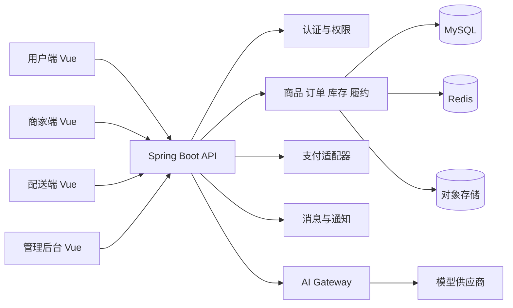

# 系统架构设计

## 总体架构

系统采用前后端分离和模块化单体起步，保留后续拆分为独立服务的边界。Vue 前端按角色加载菜单与路由；Spring Boot 负责认证、业务编排、交易一致性和审计；AI Gateway 作为受控适配层，隔离模型供应商密钥与提示词。



## 四端边界

| 端 | 路由前缀 | 主要职责 |
| --- | --- | --- |
| 用户端 | `/app` | 账号密码登录、浏览、购物、余额/微信扫码支付、订单、售后、AI 导购 |
| 商家端 | `/merchant` | 独立页面、入驻资料、商品、库存、订单、佣金结算、经营分析入口 |
| 配送端 | `/delivery` | 平台派单、接单超时、取货、配送、签收、异常、绩效 |
| 管理后台 | `/admin` | 商家审核、平台规则、固定区域、佣金、优惠/会员/积分/秒杀、客服售后、审计 |

## 推荐后端包边界

```text
com.freshmart
├── auth             认证、角色、权限、令牌
├── user             用户、地址、会员
├── catalog          分类、SPU、SKU、图片
├── inventory        库存、批次、预占、预警
├── warehouse         仓库边界、区域、批次分配、临期促销、追溯
├── order            购物车、订单、状态流水
├── payment          支付、退款、对账适配
├── fulfillment      分拣、配送任务、轨迹、签收
├── marketing        优惠券、活动、推荐位
├── openapi           客户端密钥、范围授权、签名、访问日志
├── ai               AI Gateway、会话、工具白名单
└── audit             操作日志、风控事件
```

## AI 能力与边界

首期开放：商品问答、口味/预算推荐、订单进度查询。模型不得直接修改订单、库存、退款或权限；客服可结合 AI 建议审核缺货/品质售后，但最终审核动作必须由平台客服确认。所有工具调用先经过用户身份、数据范围和参数校验，并记录请求、工具、结果摘要和耗时。涉及价格、库存和履约时，以业务服务实时结果为准。

## 验证记录

- 2026-09-08：Mermaid 严格解析校验通过，报告见 `docs/mermaid-syntax-report.md`，共 2 个图表，问题数为 0。
- 2026-09-08：Java 21 与 Git 2.54 可用；当前环境未安装 Maven，后端未执行 Maven 构建。
- 2026-09-08：前端依赖安装成功并生成 `package-lock.json`。在当前受限工作区执行 Vite 构建时，esbuild 访问工作区上层目录被拒绝，报错为 `Cannot read directory "../../../../..": Access is denied`；待在正常开发终端或调整该目录权限后重新执行 `npm run build`。
